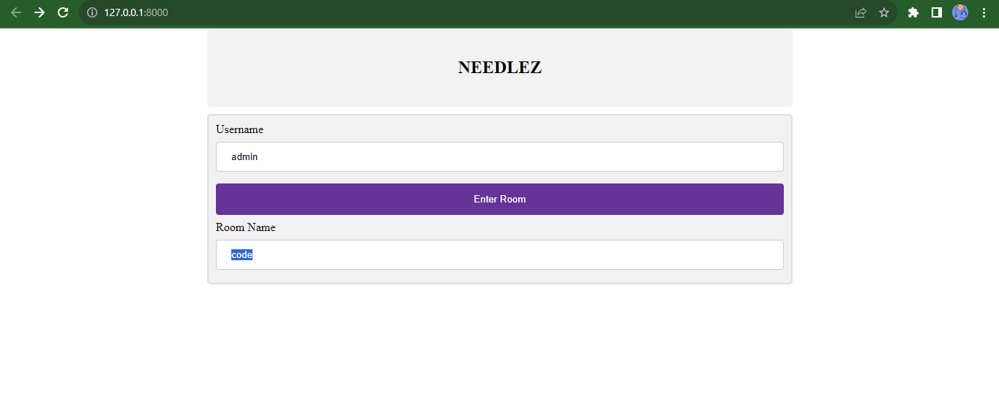

# Needlez Real-Time Chat App README



**Needlez** is a real-time chat application built using Django, HTML, CSS, and AJAX. It allows users to have instant conversations and exchange messages seamlessly. This README provides an overview of the app, its features, installation instructions, and usage guidelines.

## Table of Contents
- [Features](#features)
- [Installation](#installation)
- [Usage](#usage)
- [Technologies Used](#technologies-used)
- [Contributing](#contributing)
- [License](#license)

## Features

- **Real-Time Messaging:** Needle is designed to provide users with real-time messaging capabilities. Users can send and receive messages instantly without having to refresh the page.
  
- **User Authentication:** The app supports user registration and authentication. Users can create accounts, log in securely, and maintain their profiles.

- **Chat Rooms:** Needlez supports multiple chat rooms where users can join based on their interests or create their own private rooms for specific discussions.

- **Message Status:** Message status indicators show whether a message has been sent, delivered, or read by the recipient.

- **User Online Status:** Users can see the online/offline status of other users in their contact list.

- **Message Notifications:** Users receive notifications for new messages even when they are not actively using the app.

- **User Profile:** Users can customize their profiles by uploading profile pictures and setting status messages.

- **Responsive Design:** Needlez is built with a responsive design, ensuring a seamless user experience across different devices.

## Installation

Follow these steps to set up and run Needlez on your local machine:

1. **Clone the Repository:** Start by cloning this repository to your local machine using the following command:
   ```
   git clone https://github.com/your-username/needlez.git
   ```

2. **Create Virtual Environment:** Navigate to the project directory and create a virtual environment:
   ```
   cd needlez
   python -m venv venv
   ```

3. **Activate Virtual Environment:** Activate the virtual environment:
   - On Windows:
     ```
     venv\Scripts\activate
     ```
   - On macOS and Linux:
     ```
     source venv/bin/activate
     ```

4. **Install Dependencies:** Install the project dependencies using pip:
   ```
   pip install -r requirements.txt
   ```

5. **Database Setup:** Set up the database by running migrations:
   ```
   python manage.py migrate
   ```

6. **Start the Development Server:** Launch the development server:
   ```
   python manage.py runserver
   ```

7. **Access the App:** Open your web browser and navigate to `http://127.0.0.1:8000` to access the Needlez app.

## Usage

1. **Registration and Login:** Create an account or log in using your credentials.

2. **Chat Rooms:** Explore existing chat rooms or create your own. Join rooms based on your interests.

3. **Real-Time Messaging:** Send and receive messages in real-time. Messages will be displayed instantly without requiring a page refresh.

4. **Profile Customization:** Upload a profile picture and set a status message to personalize your profile.

5. **Notifications:** Receive notifications for new messages, even if you're not actively using the app.

6. **User Online Status:** See the online/offline status of other users in your contact list.

7. **Message Status:** Messages show indicators for sent, delivered, and read status.

## Technologies Used

- Django
- HTML
- CSS
- JavaScript
- AJAX
- SQLite (or your preferred database)

## Contributing

Contributions are welcome! If you'd like to contribute to Needlez, follow these steps:

1. Fork the repository.
2. Create a new branch for your feature or bug fix.
3. Commit your changes and push them to your fork.
4. Submit a pull request with a detailed explanation of your changes.

